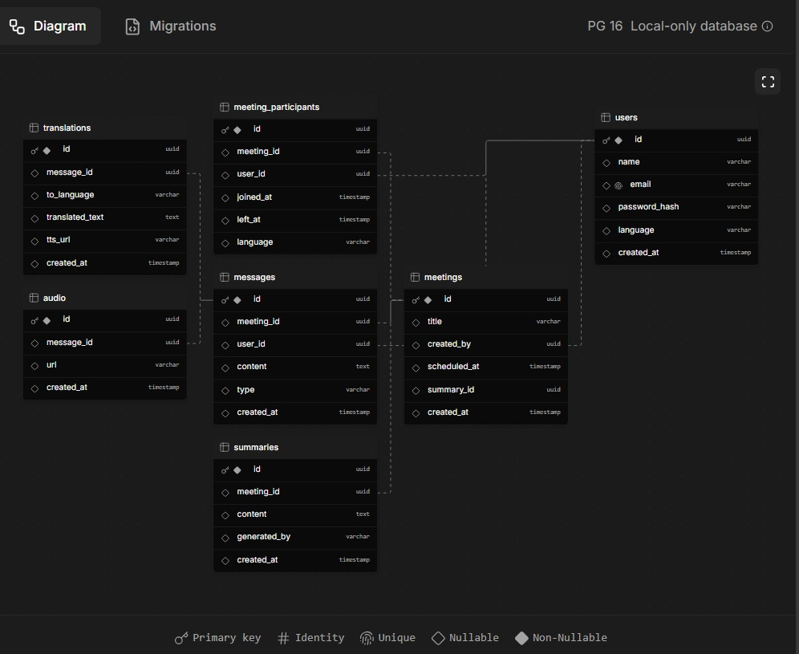

# Real-Time Translation Web Application for Meetings

## Description

This web application enables real-time translation in virtual meetings, supporting both text and speech. It uses advanced translation and speech synthesis so each participant can hear others in their preferred language, as if everyone spoke the same language. At the end of the meeting, users can generate an automatic meeting summary powered by artificial intelligence.

## Key Features

- Real-time translation of text and voice for multiple meeting participants.
- Synthetic voice (Text-to-Speech) speaks translations aloud in the selected language.
- AI-powered meeting summary available after each session.
- Simple, modern, and responsive web interface.
- Automatic detection of input language.
- Conversation and audio history.

## Technologies Used

- **Frontend:** React / Next.js
- **Backend:** Node.js + Express or NestJS
- **Translation APIs:** Google Cloud Translation, Azure Translator
- **Speech Processing:** Web Speech API, Google Cloud Text-to-Speech
- **AI Summarization:** OpenAI GPT, Azure OpenAI, or similar
- **Database:** PostgreSQL or MongoDB
- **Deployment:** AWS or Azure

## Installation & Usage

1. Clone this repository:
   ```bash
   git clone https://github.com/youruser/your-realtime-meeting-translation.git
   ```

## User Stories

### End User

#### Story 1: Real-Time Multilingual Meeting

**As** a meeting participant,  
**I want** to speak in my own language and hear other participants in my language through a synthetic voice,  
**so that** I can fully participate in multilingual meetings as if everyone spoke my language.

**Acceptance Criteria:**

- The user can join a meeting and speak in their language.
- The system detects the input language, translates, and outputs translated speech via Text-to-Speech in real time for each participant.
- Latency of translation and voice output is 2 seconds or less.

---

#### Story 2: Real-Time Text and Chat Translation

**As** a meeting participant,  
**I want** to send written messages that are automatically translated for other participants,  
**so that** written communication in meetings is barrier-free.

**Acceptance Criteria:**

- The user can send chat messages during the meeting.
- The system automatically translates and displays messages in each participant’s chosen language.
- Chat translations appear in less than 2 seconds.

---

#### Story 3: AI-Powered Meeting Summary

**As** a user,  
**I want** to receive an AI-generated summary of the meeting,  
**so that** I can quickly review the most important points and actions.

**Acceptance Criteria:**

- After the meeting, the user can request a summary.
- The system uses an AI API to generate and display a concise, accurate meeting summary.

---

#### Story 4: Conversation and Audio History

**As** a user,  
**I want** to access the meeting transcript and audio history,  
**so that** I can review previous discussions and translations.

**Acceptance Criteria:**

- The user can view transcripts and, optionally, listen to past meeting translations.
- The system securely stores and retrieves audio and text history.

---

## Acceptance Criteria (Checklist)

- [ ] Users can join a virtual meeting and communicate in their own language.
- [ ] The system translates and speaks each participant’s input in real time via synthetic voice.
- [ ] Chat messages are translated automatically for each participant.
- [ ] AI-generated meeting summaries are available after each meeting.
- [ ] Users can access meeting transcripts and (optionally) audio playback.
- [ ] Translation and voice output have 2 seconds or less latency.
- [ ] The UI is responsive and works on desktop and mobile browsers.
- [ ] The app works correctly on major

## Database Diagram

<!--
  Include your ERD or database schema here.
  You can embed an image using the markdown syntax below,
  or describe the schema if you don't have a diagram yet.
-->



_The diagram above shows the structure of tables and relationships used in this application._

## Friendship API

The Friendship API allows users to manage their friends within the application. All endpoints require authentication via JWT (use the `Authorization: Bearer <token>` header).

### Endpoints

#### Add Friend Request

**POST** `/friendship/request`

Request body:

```json
{
  "addresseeName": "<username>"
}
```

Example curl:

```bash
curl -X POST http://localhost:3001/friendship/request \
  -H "Authorization: Bearer <TOKEN>" \
  -H "Content-Type: application/json" \
  -d '{"addresseeName": "alice"}'
```

---

#### Accept Friendship

**POST** `/friendship/accept`

Request body:

```json
{
  "requesterId": "<userId>"
}
```

Example curl:

```bash
curl -X POST http://localhost:3001/friendship/accept \
  -H "Authorization: Bearer <TOKEN>" \
  -H "Content-Type: application/json" \
  -d '{"requesterId": "1234-5678-90ab-cdef"}'
```

---

#### List Friends

**GET** `/friendship/list`

Example curl:

```bash
curl -X GET http://localhost:3001/friendship/list \
  -H "Authorization: Bearer <TOKEN>"
```

---

#### List Pending Friend Requests

**GET** `/friendship/requests`

Example curl:

```bash
curl -X GET http://localhost:3001/friendship/requests \
  -H "Authorization: Bearer <TOKEN>"
```

---

## Meetings API

The Meetings API permite crear, unirse, salir, invitar y listar participantes de reuniones. Todos los endpoints requieren autenticación JWT (`Authorization: Bearer <token>`).

### Endpoints

#### Crear reunión

**POST** `/meetings/create`

Request body:

```json
{
  "title": "Project Sync",
  "type": "public" // o "private", "friends"
}
```

Ejemplo curl:

```bash
curl -X POST http://localhost:3001/meetings/create \
  -H "Authorization: Bearer <TOKEN>" \
  -H "Content-Type: application/json" \
  -d '{"title": "Project Sync", "type": "public"}'
```

---

#### Unirse a reunión

**POST** `/meetings/join`

Request body:

```json
{
  "meetingId": "<meeting-uuid>"
}
```

Ejemplo curl:

```bash
curl -X POST http://localhost:3001/meetings/join \
  -H "Authorization: Bearer <TOKEN>" \
  -H "Content-Type: application/json" \
  -d '{"meetingId": "<meeting-uuid>"}'
```

---

#### Salir de reunión

**POST** `/meetings/leave`

Request body:

```json
{
  "meetingId": "<meeting-uuid>"
}
```

Ejemplo curl:

```bash
curl -X POST http://localhost:3001/meetings/leave \
  -H "Authorization: Bearer <TOKEN>" \
  -H "Content-Type: application/json" \
  -d '{"meetingId": "<meeting-uuid>"}'
```

---

#### Ver participantes activos

**GET** `/meetings/<meetingId>/participants`

Ejemplo curl:

```bash
curl -X GET http://localhost:3001/meetings/<meetingId>/participants \
  -H "Authorization: Bearer <TOKEN>"
```

---

#### Invitar a reunión privada

**POST** `/meetings/invite`

Request body:

```json
{
  "meetingId": "<meeting-uuid>",
  "invitedId": "<user-uuid>"
}
```

Ejemplo curl:

```bash
curl -X POST http://localhost:3001/meetings/invite \
  -H "Authorization: Bearer <TOKEN>" \
  -H "Content-Type: application/json" \
  -d '{"meetingId": "<meeting-uuid>", "invitedId": "<user-uuid>"}'
```

---

#### Aceptar invitación a reunión

**POST** `/meetings/invite/accept`

Request body:

```json
{
  "invitationId": "<invitation-uuid>"
}
```

Ejemplo curl:

```bash
curl -X POST http://localhost:3001/meetings/invite/accept \
  -H "Authorization: Bearer <TOKEN>" \
  -H "Content-Type: application/json" \
  -d '{"invitationId": "<invitation-uuid>"}'
```
